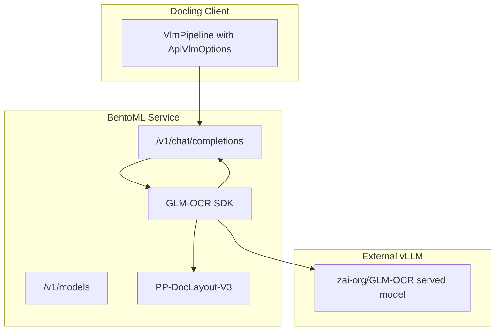

# BentoML GLM-OCR Docling-Compatible Proxy API

OpenAI-compatible VLM proxy built with BentoML that exposes GLM-OCR SDK for Docling.

It combines:
- local **PP-DocLayout-V3** layout detection
- external **vLLM-hosted GLM-OCR** recognition
- OpenAI `/v1/chat/completions` API shape expected by Docling remote VLM runtime

## Architecture



## Supported models

- `glm-ocr`: full two-stage OCR pipeline (layout + OCR)
- `glm-ocr-raw`: passthrough mode to external vLLM endpoint

## Quickstart

### 1) Prerequisites

- Python 3.12
- `uv` installed
- A running external vLLM endpoint serving GLM-OCR

Example vLLM endpoint:
- `http://localhost:8080/v1/chat/completions`

### 2) Install dependencies

```bash
uv sync --extra dev
```

### 3) Run the service

```bash
export VLLM_API_URL="http://localhost:8080/v1/chat/completions"
export VLLM_MODEL_NAME="glm-ocr"
uv run bentoml serve service:GLMOCRProxy
```

### 4) Test with curl

```bash
curl -X POST "http://localhost:3000/v1/chat/completions" \
  -H "Content-Type: application/json" \
  -d '{
    "model":"glm-ocr",
    "messages":[
      {
        "role":"user",
        "content":[
          {"type":"text","text":"Recognize the page"},
          {"type":"image_url","image_url":{"url":"data:image/png;base64,<BASE64_IMAGE>"}}
        ]
      }
    ]
  }'
```

## Configuration

| Variable | Description | Default |
|---|---|---|
| `VLLM_API_URL` | external vLLM OpenAI-compatible endpoint | `http://localhost:8080/v1/chat/completions` |
| `VLLM_MODEL_NAME` | model name sent to external vLLM | `glm-ocr` |
| `GLMOCR_REQUEST_TIMEOUT_SECONDS` | timeout for OCR and passthrough requests | `300` |
| `GLMOCR_ENABLE_LAYOUT` | enable PP-DocLayout-V3 pipeline | `true` |
| `GLMOCR_MAX_WORKERS` | region OCR parallelism hint | `16` |
| `GLMOCR_LOG_LEVEL` | GLM-OCR SDK log level | `INFO` |
| `GLMOCR_CONFIG_PATH` | optional path to SDK config file | unset |

## GLM-OCR vLLM container startup command

```bash
docker run -d \
  --name ocr-glm \
  --gpus all \
  --ipc=host \
  -p 8002:8000 \
  -v "${HOME}/.cache/huggingface:/root/.cache/huggingface" \
  -e "HUGGING_FACE_HUB_TOKEN=${HUGGING_FACE_HUB_TOKEN:-}" \
  -e "HF_TOKEN=${HF_TOKEN:-}" \
  -e "LD_LIBRARY_PATH=/lib/x86_64-linux-gnu" \
  --entrypoint /bin/bash \
  vllm/vllm-openai:cu130-nightly \
  -c "uv pip install --system --upgrade transformers && exec vllm serve --model zai-org/GLM-OCR --served-model-name zai-org/GLM-OCR --port 8000 --trust-remote-code"
```
## Docling integration example

```python
from docling.datamodel.base_models import InputFormat
from docling.datamodel.pipeline_options import VlmConvertOptions, VlmPipelineOptions
from docling.datamodel.pipeline_options_vlm_model import ResponseFormat
from docling.datamodel.vlm_engine_options import ApiVlmEngineOptions, VlmEngineType
from docling.document_converter import DocumentConverter, PdfFormatOption
from docling.pipeline.vlm_pipeline import VlmPipeline

vlm_options = VlmConvertOptions.from_preset(
    "granite_docling",
    engine_options=ApiVlmEngineOptions(
        runtime_type=VlmEngineType.API,
        url="http://glm-proxy:3000/v1/chat/completions",
        params={"model": "glm-ocr", "max_tokens": 16384},
        timeout=300,
    ),
)
vlm_options.model_spec.response_format = ResponseFormat.MARKDOWN

pipeline_options = VlmPipelineOptions(
    vlm_options=vlm_options,
    enable_remote_services=True,
)

converter = DocumentConverter(
    format_options={
        InputFormat.PDF: PdfFormatOption(
            pipeline_cls=VlmPipeline,
            pipeline_options=pipeline_options,
        )
    }
)
```

## API reference

### `GET /v1/models`

Returns supported model IDs.

### `POST /v1/chat/completions`

OpenAI-compatible chat completion endpoint.

Notes:
- image content must be sent via `image_url.url` as `data:image/<mime>;base64,...`
- streaming is currently not supported

## Rigorous testing workflow

### Unit + integration (required on every change)

```bash
uv run ruff check .
uv run ruff format --check .
uv run mypy
uv run pytest tests/ -v --cov=. --cov-report=term-missing -m "not e2e"
```

### End-to-end tests (real infrastructure)

Requires:
- running proxy instance
- running external vLLM instance

```bash
export E2E_PROXY_URL="http://localhost:3000"
uv run pytest tests/test_e2e.py -v -m e2e
```

Recommended for release candidates:
- run e2e against at least one real PDF and one real scanned image
- compare OCR output quality against a golden baseline
- capture latency and success-rate metrics for 100+ requests

## CI/CD

### CI (`.github/workflows/ci.yml`)

Runs on push/PR:
- lint (`ruff`)
- type-check (`mypy`)
- unit + integration tests with coverage

### CD (`.github/workflows/cd.yml`)

Runs on version tags (`v*`):
- builds Bento
- containerizes with BentoML
- pushes image to `ghcr.io/<owner>/<repo>:<tag>` and `:latest`

## Build and run container

```bash
uv sync
uv run bentoml build
uv run bentoml containerize glm-ocr-proxy:latest
docker run --gpus all -p 3000:3000 \
  -e VLLM_API_URL="http://vllm-host:8080/v1/chat/completions" \
  glm-ocr-proxy:latest
```

## Pull from GHCR

```bash
docker pull ghcr.io/<owner>/<repo>:latest
docker run --gpus all -p 3000:3000 \
  -e VLLM_API_URL="http://vllm-host:8080/v1/chat/completions" \
  ghcr.io/<owner>/<repo>:latest
```
