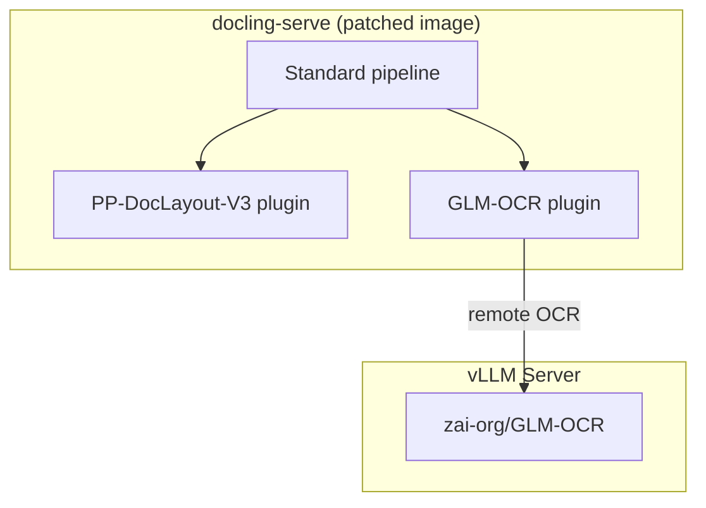

# Docling-Serve Plugins: PP-DocLayout-V3 + GLM-OCR

[](https://github.com/DCC-BS/bentoml-ocr/actions/workflows/ci.yml)

A patched [docling-serve](https://github.com/docling-project/docling-serve) Docker
image that bundles two community plugins:

| Plugin | PyPI | Purpose |
| --- | --- | --- |
| [docling-glm-ocr](https://github.com/DCC-BS/docling-glm-ocr) | `pip install docling-glm-ocr` | Remote OCR via a vLLM-hosted GLM-OCR model |
| [docling-pp-doc-layout](https://github.com/DCC-BS/docling-pp-doc-layout) | `pip install docling-pp-doc-layout` | Local layout detection via PP-DocLayout-V3 |

The plugins are selectable per-request through the standard docling-serve API:

- **Layout** -- `layout_custom_config: { "kind": "ppdoclayout-v3" }`
- **OCR** -- `ocr_engine: "glm-ocr-remote"`

The patched Gradio UI also exposes both engines as selectable options.

## Architecture



## Quickstart

### 1) Prerequisites

- Docker with GPU support (NVIDIA)
- A HuggingFace token with access to the GLM-OCR model

### 2) Configure

Copy `.env.example` to `.env` and set the required variables:

```bash
cp .env.example .env
# edit .env — at minimum set HF_TOKEN
```

### 3) Start the stack

```bash
make docker-up
```

This starts two services:

| Service | Purpose |
| --- | --- |
| **vllm-glm-ocr** | vLLM server hosting `zai-org/GLM-OCR` (GPU 1) |
| **docling-serve** | Docling API + Gradio UI with both plugins (GPU 0) |

The Gradio UI is available at http://localhost:5001.

### 4) Convert a document

```bash
curl -X POST http://localhost:5001/v1/convert/source \
  -H 'Content-Type: application/json' \
  -d '{
    "options": {
      "ocr_engine": "glm-ocr-remote",
      "layout_custom_config": { "kind": "ppdoclayout-v3" }
    },
    "sources": [{"kind": "http", "url": "https://arxiv.org/pdf/2501.17887"}]
  }'
```

## Docker Compose

The `compose.yaml` references the pre-built image from GHCR:

```
ghcr.io/dcc-bs/bentoml-ocr-docling-serve:latest
```

| Service | Image |
| --- | --- |
| **vllm-glm-ocr** | `vllm/vllm-openai:cu130-nightly` |
| **docling-serve** | `ghcr.io/dcc-bs/bentoml-ocr-docling-serve:latest` |

Environment variables are documented in `.env.example`.

```bash
make docker-up    # start all services
make docker-down  # stop all services
```

### Building the image locally

To build the patched docling-serve image from source:

```bash
make docker-build
```

This runs `docker build` against `plugins/Dockerfile.docling-serve` and tags the
result as `docling-serve-plugins:latest`.

#### Running the locally built image

To test the local image without pushing it to GHCR, use the compose stack but
override the image name via `DOCLING_SERVE_TAG` and a matching tag alias, or run
`docling-serve` directly with `docker run`:

```bash
docker run --rm \
  --gpus device=0 \
  -p 5001:5001 \
  -e DOCLING_SERVE_ENABLE_UI=true \
  -e DOCLING_SERVE_ENABLE_REMOTE_SERVICES=true \
  -e DOCLING_SERVE_ALLOW_EXTERNAL_PLUGINS=true \
  -e GLMOCR_REMOTE_OCR_API_URL=http://host.docker.internal:8001/v1/chat/completions \
  docling-serve-plugins:latest
```

The Gradio UI is then available at http://localhost:5001.

Alternatively, re-tag the local image to match the compose service name and use
the normal `make docker-up` flow:

```bash
make docker-build
docker tag docling-serve-plugins:latest ghcr.io/dcc-bs/bentoml-ocr-docling-serve:latest
make docker-up
```

## Plugin configuration

### GLM-OCR remote OCR

| Option | Description | Default |
| --- | --- | --- |
| `api_url` | vLLM chat completion URL | `GLMOCR_REMOTE_OCR_API_URL` env or `http://localhost:8001/v1/chat/completions` |
| `model_name` | Model name sent to vLLM | `zai-org/GLM-OCR` |
| `prompt` | Text prompt for each crop | `GLMOCR_REMOTE_OCR_PROMPT` env or default prompt |
| `timeout` | HTTP timeout per crop (seconds) | `120` |
| `max_tokens` | Max tokens per completion | `16384` |
| `scale` | Image crop rendering scale | `3.0` |
| `max_concurrent_requests` | Max concurrent API requests | `10` |
| `max_retries` | Max retry attempts for HTTP errors | `3` |
| `retry_backoff_factor` | Exponential backoff factor | `2.0` |

### PP-DocLayout-V3 layout

| Option | Description | Default |
| --- | --- | --- |
| `model_name` | HuggingFace model repo ID | `PaddlePaddle/PP-DocLayoutV3_safetensors` |
| `confidence_threshold` | Minimum detection confidence (0-1) | `0.5` |
| `batch_size` | Batch size for layout inference | `8` |

## Python SDK usage

The plugins can also be used directly with the docling Python SDK (without
docling-serve). See `examples/convert_with_plugins.py`:

```python
from docling.datamodel.base_models import InputFormat
from docling.datamodel.pipeline_options import PdfPipelineOptions
from docling.document_converter import DocumentConverter, PdfFormatOption

from docling_glm_ocr import GlmOcrRemoteOptions
from docling_pp_doc_layout.options import PPDocLayoutV3Options

pipeline_options = PdfPipelineOptions(
    allow_external_plugins=True,
    ocr_options=GlmOcrRemoteOptions(
        api_url="http://localhost:8001/v1/chat/completions",
        model_name="zai-org/GLM-OCR",
    ),
    layout_options=PPDocLayoutV3Options(),
)

converter = DocumentConverter(
    format_options={InputFormat.PDF: PdfFormatOption(pipeline_options=pipeline_options)}
)
result = converter.convert("https://arxiv.org/pdf/2501.17887")
print(result.document.export_to_markdown())
```

## vLLM GLM-OCR container

Standalone command to run the GLM-OCR vLLM server:

```bash
docker run -d \
  --rm --name ocr-glm \
  --gpus device=1 \
  --ipc=host \
  -p 8001:8000 \
  -v "${HOME}/.cache/huggingface:/root/.cache/huggingface" \
  -e "HF_TOKEN=${HF_TOKEN:-}" \
  --entrypoint /bin/bash \
  vllm/vllm-openai:cu130-nightly \
  -c "uv pip install --system --upgrade transformers && \
      exec vllm serve zai-org/GLM-OCR \
        --served-model-name zai-org/GLM-OCR \
        --port 8000 \
        --trust-remote-code"
```

## Testing

### Lint

```bash
make check
```

### End-to-end tests

The e2e tests require a running stack (docling-serve + vLLM). They use the
images in `data/` to validate conversion through both plugins.

```bash
export DOCLING_SERVE_URL=http://localhost:5001
make test-e2e
```

Tests are skipped automatically when `DOCLING_SERVE_URL` is not set.

## CI/CD

### CI (`.github/workflows/ci.yml`)

Runs on push/PR: lint with ruff.

### Docker image (`.github/workflows/docling-serve.yml`)

Builds and pushes the patched docling-serve image to GHCR. Triggered on:

- Push to `main` when files in `plugins/` change
- Manual dispatch (with configurable upstream tag)

## License

MIT
