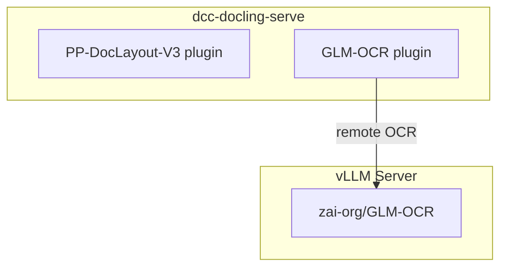

# Docling-Serve Plugins: PP-DocLayout-V3 + GLM-OCR

[](https://github.com/DCC-BS/dcc-docling-serve/actions/workflows/ci.yml)

A patched [docling-serve](https://github.com/docling-project/docling-serve) Docker
image that bundles two community plugins:

## Available images

| Image | Based on | Architectures | Notes |
| --- | --- | --- | --- |
| `ghcr.io/dcc-bs/dcc-docling-serve` | `docling-serve` | linux/amd64, linux/arm64 | Base image, packages from PyPI |
| `ghcr.io/dcc-bs/dcc-docling-serve-cpu` | `docling-serve-cpu` | linux/amd64, linux/arm64 | CPU-only, torch from PyTorch CPU index |
| `ghcr.io/dcc-bs/dcc-docling-serve-cu128` | `docling-serve-cu128` | linux/amd64 | CUDA 12.8, torch from cu128 index |
| `ghcr.io/dcc-bs/dcc-docling-serve-cu130` | `docling-serve-cu130` | linux/amd64, linux/arm64 | CUDA 13.0, torch from cu130 index |

Each image is tagged with the upstream docling-serve version (e.g. `v2.3.0`) and `:latest`.

## Plugins

| Plugin | PyPI | Purpose |
| --- | --- | --- |
| [docling-glm-ocr](https://github.com/DCC-BS/docling-glm-ocr) | `pip install docling-glm-ocr` | Remote OCR via a vLLM-hosted GLM-OCR model |
| [docling-pp-doc-layout](https://github.com/DCC-BS/docling-pp-doc-layout) | `pip install docling-pp-doc-layout` | Local layout detection via PP-DocLayout-V3 |

The plugins are selectable per-request through the standard docling-serve API:

- **Layout** -- `layout_custom_config: { "kind": "ppdoclayout-v3" }`
- **OCR** -- `ocr_engine: "glm-ocr-remote"`

The patched Gradio UI also exposes both engines as selectable options.

## Architecture



## Quickstart

### 1) Prerequisites

- Docker with GPU support (NVIDIA)
- A HuggingFace token with access to the GLM-OCR model

### 2) Configure

Copy `.env.example` to `.env` and set the required variables:

```bash
cp .env.example .env
# edit .env — at minimum set HF_TOKEN
```

| Variable | Description | Default |
| --- | --- | --- |
| `HF_TOKEN` | HuggingFace token for downloading GLM-OCR (required) | — |
| `HF_CACHE_DIR` | Host directory for the HF model cache | `.hf-cache` |
| `VLLM_HOST_PORT` | Host port for the vLLM server | `8001` |
| `DOCLING_HOST_PORT` | Host port for docling-serve | `5001` |
| `DOCLING_SERVE_TAG` | Upstream docling-serve image tag | `latest` |
| `DOCLING_SERVE_LOG_LEVEL` | Log level for docling-serve | `INFO` |

### 3) Start the stack

```bash
make docker-up
```

This starts two services:

| Service | Purpose |
| --- | --- |
| **vllm-glm-ocr** | vLLM server hosting `zai-org/GLM-OCR` (GPU 1) |
| **docling-serve** | Docling API + Gradio UI with both plugins (GPU 0) |

The Gradio UI is available at http://localhost:5001.

### 4) Convert a document

```bash
curl -X POST http://localhost:5001/v1/convert/source \
  -H 'Content-Type: application/json' \
  -d '{
    "options": {
      "ocr_engine": "glm-ocr-remote",
      "layout_custom_config": { "kind": "ppdoclayout-v3" }
    },
    "sources": [{"kind": "http", "url": "https://arxiv.org/pdf/2501.17887"}]
  }'
```

## Docker Compose

The `compose.yaml` references the pre-built image from GHCR:

```
ghcr.io/dcc-bs/dcc-docling-serve:latest
```

| Service | Image |
| --- | --- |
| **vllm-glm-ocr** | `ghcr.io/dcc-bs/vllm:v0.16.0-cu130` |
| **docling-serve** | `ghcr.io/dcc-bs/dcc-docling-serve:latest` |

Environment variables are documented in `.env.example`.

```bash
make docker-up    # start all services
make docker-down  # stop all services
```

### Building the image locally

To build the patched docling-serve image from source:

```bash
make docker-build
```

This runs `docker build` against `plugins/Dockerfile.docling-serve` and tags the
result as `docling-serve-plugins:latest`.

#### Running the locally built image

To test the local image without pushing it to GHCR, use the compose stack but
override the image name via `DOCLING_SERVE_TAG` and a matching tag alias, or run
`docling-serve` directly with `docker run`:

```bash
docker run --add-host=host.docker.internal:host-gateway --rm \
  --gpus device=0 \
  -p 5001:5001 \
  -e DOCLING_SERVE_ENABLE_UI=true \
  -e DOCLING_SERVE_ENABLE_REMOTE_SERVICES=true \
  -e DOCLING_SERVE_ALLOW_EXTERNAL_PLUGINS=true \
  -e GLMOCR_REMOTE_OCR_API_URL=http://host.docker.internal:8001/v1/chat/completions \
  docling-serve-plugins:latest
```

The Gradio UI is then available at http://localhost:5001.

Alternatively, re-tag the local image to match the compose service name and use
the normal `make docker-up` flow:

```bash
make docker-build
docker tag docling-serve-plugins:latest ghcr.io/dcc-bs/dcc-docling-serve:latest
make docker-up
```

## Plugin configuration

Both plugins are fully configurable via environment variables, making them
suitable for zero-code deployment in Docker / Compose environments.
Explicit `GlmOcrRemoteOptions` / `PPDocLayoutV3Options` constructor arguments
always take precedence when using the Python SDK directly.

### GLM-OCR remote OCR — environment variables

| Variable | Description | Default |
| --- | --- | --- |
| `GLMOCR_REMOTE_OCR_API_URL` | vLLM chat completion URL | `http://localhost:8001/v1/chat/completions` |
| `GLMOCR_REMOTE_OCR_MODEL_NAME` | Model name sent to vLLM | `zai-org/GLM-OCR` |
| `GLMOCR_REMOTE_OCR_PROMPT` | Text prompt sent with each image crop | built-in default |
| `GLMOCR_REMOTE_OCR_TIMEOUT` | HTTP timeout per crop (seconds) | `120` |
| `GLMOCR_REMOTE_OCR_MAX_TOKENS` | Max tokens per completion | `16384` |
| `GLMOCR_REMOTE_OCR_SCALE` | Image crop rendering scale | `3.0` |
| `GLMOCR_REMOTE_OCR_MAX_IMAGE_PIXELS` | Pixel budget per crop | `4500000` |
| `GLMOCR_REMOTE_OCR_MAX_CONCURRENT_REQUESTS` | Max concurrent API requests | `10` |
| `GLMOCR_REMOTE_OCR_MAX_RETRIES` | Max retry attempts for HTTP errors | `3` |
| `GLMOCR_REMOTE_OCR_RETRY_BACKOFF_FACTOR` | Exponential backoff factor for retries | `2.0` |
| `GLMOCR_REMOTE_OCR_LANG` | Comma-separated language hint(s) | `en` |
| `GLMOCR_REMOTE_OCR_API_KEY` | Bearer token for `Authorization` header | unset (no header sent) |

### PP-DocLayout-V3 layout — environment variables

| Variable | Description | Default |
| --- | --- | --- |
| `PP_DOC_LAYOUT_MODEL_NAME` | HuggingFace model repo ID | `PaddlePaddle/PP-DocLayoutV3_safetensors` |
| `PP_DOC_LAYOUT_CONFIDENCE_THRESHOLD` | Minimum detection confidence (0.0–1.0) | `0.5` |
| `PP_DOC_LAYOUT_BATCH_SIZE` | Batch size for layout inference | `8` |
| `PP_DOC_LAYOUT_CREATE_ORPHAN_CLUSTERS` | Create clusters for orphaned elements (`true`/`false`) | `true` |
| `PP_DOC_LAYOUT_KEEP_EMPTY_CLUSTERS` | Retain empty clusters in results (`true`/`false`) | `false` |
| `PP_DOC_LAYOUT_SKIP_CELL_ASSIGNMENT` | Skip table-cell assignment (`true`/`false`) | `false` |

Boolean variables accept `true`, `1`, `yes` (case-insensitive) as truthy; anything else is `false`.

### SDK option reference

All environment variables above correspond to fields on `GlmOcrRemoteOptions`
and `PPDocLayoutV3Options`.  See the individual plugin READMEs for the full
option reference:

- [`docling-glm-ocr` README](https://github.com/DCC-BS/docling-glm-ocr#configuration)
- [`docling-pp-doc-layout` README](https://github.com/DCC-BS/docling-pp-doc-layout#configuration-options)

## Python SDK usage

The plugins can also be used directly with the docling Python SDK (without
docling-serve). See `examples/convert_with_plugins.py`:

```python
from docling.datamodel.base_models import InputFormat
from docling.datamodel.pipeline_options import PdfPipelineOptions
from docling.document_converter import DocumentConverter, PdfFormatOption

from docling_glm_ocr import GlmOcrRemoteOptions
from docling_pp_doc_layout.options import PPDocLayoutV3Options

pipeline_options = PdfPipelineOptions(
    allow_external_plugins=True,
    ocr_options=GlmOcrRemoteOptions(
        api_url="http://localhost:8001/v1/chat/completions",
        model_name="zai-org/GLM-OCR",
    ),
    layout_options=PPDocLayoutV3Options(),
)

converter = DocumentConverter(
    format_options={InputFormat.PDF: PdfFormatOption(pipeline_options=pipeline_options)}
)
result = converter.convert("https://arxiv.org/pdf/2501.17887")
print(result.document.export_to_markdown())
```

## vLLM GLM-OCR container

Standalone command to run the GLM-OCR vLLM server:

```bash
docker run -d \
  --rm --name ocr-glm \
  --gpus device=1 \
  --ipc=host \
  -p 8001:8000 \
  -v "${HOME}/.cache/huggingface:/root/.cache/huggingface" \
  -e "HF_TOKEN=${HF_TOKEN:-}" \
  -e "LD_LIBRARY_PATH=/lib/x86_64-linux-gnu" \
  ghcr.io/dcc-bs/vllm:v0.16.0-cu130 \
  zai-org/GLM-OCR \
  --served-model-name zai-org/GLM-OCR \
  --port 8000 \
  --trust-remote-code \
  --max-num-batched-tokens 8192
```

### Required: `--max-num-batched-tokens 8192`

> **Without this flag, vLLM will reject any high-resolution image with HTTP 400.**

In vLLM 0.16.0+ (v1 engine), the encoder cache size is derived from
`max_num_batched_tokens` (default **2048** when chunked prefill is enabled):

```
encoder_cache_size = max(max_num_batched_tokens, model_max_tokens_per_image)
                   = max(2048, 4800)  ←  4800 is GLM-OCR's model floor
                   = 4800 tokens      ←  too small for real documents
```

The `Glm46VImageProcessor` encodes images at approximately **784 pixels per token**
(`patch_size=14 × merge_size=2`, squared). A typical A4 page rendered at scale 3×
(1785 × 2526 px) produces **5760 tokens**; a phone-photo crop at scale 3× can reach
**6120 tokens** — both exceed the default 4800-token cache and are rejected.

Setting `--max-num-batched-tokens 8192` raises the encoder cache to
`max(8192, 4800) = 8192` tokens, which covers all real-world inputs with comfortable
headroom.

> **Note:** `--limit-mm-per-prompt` does **not** control the encoder cache size in
> vLLM 0.16.0. That flag only limits the *count* of images per request.

## Testing

### Setup (dev)

```bash
make install
```

### Format and lint

```bash
make check
```

Runs `ruff format` (auto-format) and `ruff check --fix` (auto-fix lint errors) locally.
The CI workflow runs these as read-only checks.

### Unit tests

```bash
make test
```

### Smoke test (local SDK)

Tests the plugins directly via the Python SDK, without a running docling-serve instance.
Requires the plugin repos checked out as siblings of this repo:

```bash
./smoke_test.sh
# or with a custom vLLM URL:
GLMOCR_REMOTE_OCR_API_URL=http://host:8001/v1/chat/completions ./smoke_test.sh
```

### End-to-end tests

The e2e tests require a running stack (docling-serve + vLLM). They use the
images in `data/` to validate conversion through both plugins.

```bash
export DOCLING_SERVE_URL=http://localhost:5001
make test-e2e
```

Tests are skipped automatically when `DOCLING_SERVE_URL` is not set.

## CI/CD

### CI (`.github/workflows/ci.yml`)

Runs on push/PR: lint with ruff.

### Docker image (`.github/workflows/docling-serve.yml`)

Builds and pushes the patched docling-serve image to GHCR. Triggered on:

- Push to `main` when files in `plugins/` change
- Manual dispatch (with configurable upstream tag)

## License

MIT
