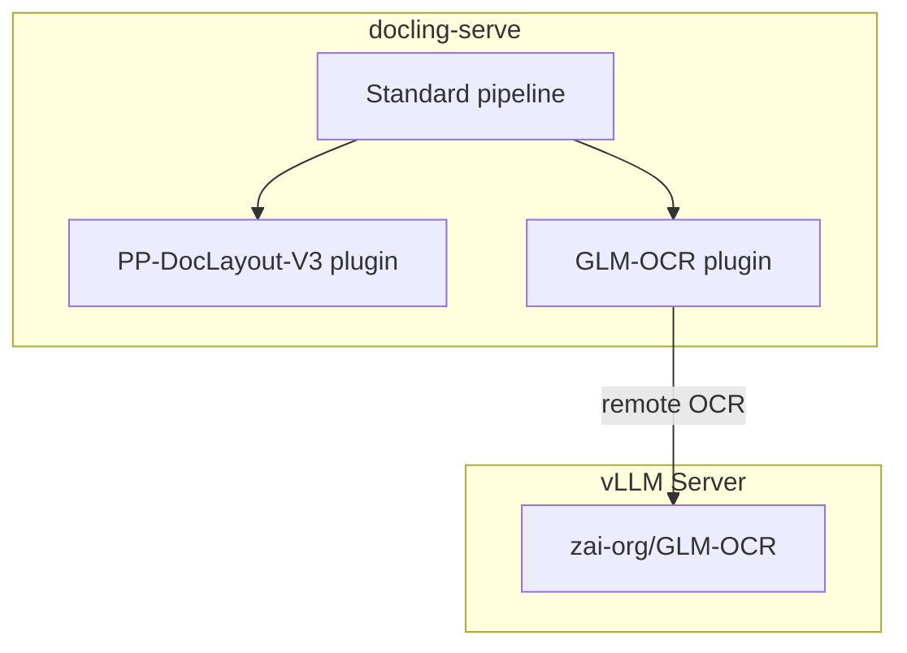

# Docling Plugins: PP-DocLayout-V3 + GLM-OCR


[](https://github.com/DCC-BS/bentoml-ocr/actions/workflows/ci.yml)
[](https://codecov.io/gh/DCC-BS/bentoml-ocr)

Docling plugins that bring **PP-DocLayout-V3** layout detection and
**GLM-OCR** text recognition to docling-serve's standard pipeline.

The two plugins are installed into a custom docling-serve image and can be
selected per-request via the standard API:

- **Layout** -- `layout_custom_config: { "kind": "ppdoclayout-v3" }`
- **OCR** -- `ocr_engine: "glm-ocr-remote"`

## Architecture



## Quickstart

### 1) Prerequisites

- Docker with GPU support (NVIDIA)
- A HuggingFace token with access to the GLM-OCR model

### 2) Configure

Copy `.env.example` to `.env` and set the required variables (HF token, ports).

### 3) Start the stack

```bash
make docker-up
```

This starts two services:

| Service | Purpose |
| --- | --- |
| **vllm-glm-ocr** | vLLM server hosting `zai-org/GLM-OCR` (GPU 1) |
| **docling-serve** | Docling API + UI with PP-DocLayout-V3 layout and GLM-OCR OCR plugins (GPU 0) |

### 4) Convert a document

```bash
curl -X POST http://localhost:5001/v1/convert/source \
  -H 'Content-Type: application/json' \
  -d '{
    "options": {
      "ocr_engine": "glm-ocr-remote",
      "layout_custom_config": { "kind": "ppdoclayout-v3" }
    },
    "sources": [{"kind": "http", "url": "https://arxiv.org/pdf/2501.17887"}]
  }'
```

Once running, the docling-serve UI is available at http://localhost:5001.

## Docling-serve integration

Both plugins are configured per-request through docling-serve's
`/v1/convert/source` endpoint. The compose stack sets
`DOCLING_SERVE_ALLOW_EXTERNAL_PLUGINS=true` and
`DOCLING_SERVE_ENABLE_REMOTE_SERVICES=true` so the plugins are loaded
automatically.

### curl

```bash
curl -X POST http://localhost:5001/v1/convert/source \
  -H 'Content-Type: application/json' \
  -d '{
    "options": {
      "ocr_engine": "glm-ocr-remote",
      "layout_custom_config": { "kind": "ppdoclayout-v3" }
    },
    "sources": [{"kind": "http", "url": "https://arxiv.org/pdf/2501.17887"}]
  }'
```

### Python SDK

```python
from docling.datamodel.base_models import InputFormat
from docling.datamodel.pipeline_options import PdfPipelineOptions
from docling.document_converter import DocumentConverter, PdfFormatOption

from docling_glmocr_plugin.options import GlmOcrRemoteOptions
from docling_ppdoclayout_plugin.options import PPDocLayoutV3Options

pipeline_options = PdfPipelineOptions(
    allow_external_plugins=True,
    ocr_options=GlmOcrRemoteOptions(
        api_url="http://vllm-glm-ocr:8000/v1/chat/completions",
        model_name="zai-org/GLM-OCR",
    ),
    layout_options=PPDocLayoutV3Options(),
)

converter = DocumentConverter(
    format_options={
        InputFormat.PDF: PdfFormatOption(pipeline_options=pipeline_options)
    }
)
result = converter.convert("https://arxiv.org/pdf/2501.17887")
print(result.document.export_to_markdown())
```

## Plugins

### PP-DocLayout-V3 layout plugin (`docling-ppdoclayout-plugin`)

Runs [PaddlePaddle/PP-DocLayoutV3](https://huggingface.co/PaddlePaddle/PP-DocLayoutV3_safetensors)
locally via HuggingFace `transformers` to detect 23 types of document layout
elements (text, tables, figures, headers, formulas, etc.).

| Option | Description | Default |
| --- | --- | --- |
| `model_name` | HuggingFace model repo ID | `PaddlePaddle/PP-DocLayoutV3_safetensors` |
| `confidence_threshold` | Minimum detection confidence (0-1) | `0.5` |

### GLM-OCR remote OCR plugin (`docling-glmocr-plugin`)

Sends each page crop to a vLLM-hosted GLM-OCR model for text recognition.

| Option | Description | Default |
| --- | --- | --- |
| `api_url` | vLLM chat completion URL | `GLMOCR_REMOTE_OCR_API_URL` env or `http://localhost:8001/v1/chat/completions` |
| `model_name` | Model name sent to vLLM | `zai-org/GLM-OCR` |
| `prompt` | Text prompt for each crop | `GLMOCR_REMOTE_OCR_PROMPT` env or default prompt |
| `timeout` | HTTP timeout per crop (seconds) | `120` |
| `max_tokens` | Max tokens per completion | `16384` |

## GLM-OCR vLLM container startup command

```bash
docker run -d \
  --rm --name ocr-glm \
  --gpus device=1 \
  --ipc=host \
  -p 8001:8000 \
  -v "${HOME}/.cache/huggingface:/root/.cache/huggingface" \
  -e "HUGGING_FACE_HUB_TOKEN=${HUGGING_FACE_HUB_TOKEN:-}" \
  -e "HF_TOKEN=${HF_TOKEN:-}" \
  -e "LD_LIBRARY_PATH=/lib/x86_64-linux-gnu" \
  --entrypoint /bin/bash \
  vllm/vllm-openai:cu130-nightly \
  -c "uv pip install --system --upgrade transformers && exec vllm serve --model zai-org/GLM-OCR --served-model-name zai-org/GLM-OCR --port 8000 --trust-remote-code"
```

## Docker Compose

A `compose.yaml` is provided with two services:

| Service | Purpose |
| --- | --- |
| **vllm-glm-ocr** | vLLM server hosting `zai-org/GLM-OCR` (GPU) |
| **docling-serve** | Docling API with UI, built with PP-DocLayout-V3 layout and GLM-OCR OCR plugins (GPU) |

The `docling-serve` image is built from `plugins/Dockerfile.docling-serve` which
extends the upstream image with both docling plugins. The
`GLMOCR_REMOTE_OCR_API_URL` environment variable points the OCR plugin at the
`vllm-glm-ocr` service automatically.

```bash
make docker-up    # start all services
make docker-down  # stop all services
```

See `.env.example` for Docker Compose-specific settings (ports, image tags, HF token).

## Testing

### Lint and type-check

```bash
make check
```

Or manually:

```bash
uv run ruff check .
uv run ruff format --check .
uv run ty check .
```

### Unit + integration tests

```bash
make test
```

Or with coverage:

```bash
make test-cov
```

### End-to-end tests (real infrastructure)

Requires a running proxy instance and external vLLM instance.

```bash
export E2E_PROXY_URL="http://localhost:3000"
make test-e2e
```

### Load tests

Runs 40 concurrent workers for 5 minutes against a live service:

```bash
export E2E_PROXY_URL="http://localhost:3000"
make test-load
```

## CI/CD

### CI (`.github/workflows/ci.yml`)

Runs on push/PR:

- lint (`ruff`)
- type-check (`ty`)
- unit + integration tests with coverage

### CD (`.github/workflows/cd.yml`)

Runs on version tags (`v*`):

- builds Bento
- containerizes with BentoML
- scans image with Trivy (fails on CRITICAL/HIGH vulnerabilities)
- pushes image to `ghcr.io/<owner>/<repo>:<tag>` and `:latest`

### Docling-serve image (`.github/workflows/docling-serve.yml`)

Manual workflow that builds and pushes the custom docling-serve image with
both plugins installed.

## Kubernetes deployment

Kustomize manifests are provided in the `deploy/` directory (Deployment, Service, HPA, PDB, NetworkPolicy).
