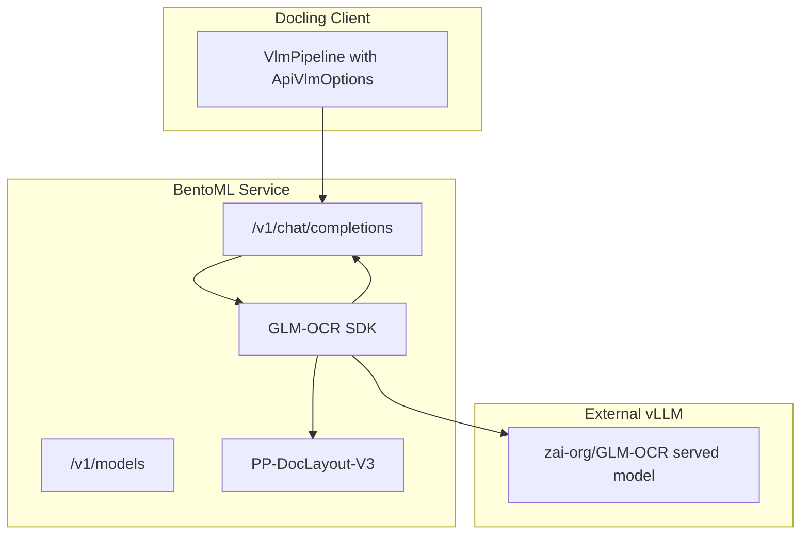

# BentoML GLM-OCR Docling-Compatible Proxy API


[](https://github.com/DCC-BS/bentoml-ocr/actions/workflows/ci.yml)
[](https://codecov.io/gh/DCC-BS/bentoml-ocr)

OpenAI-compatible VLM proxy built with BentoML that exposes GLM-OCR SDK for Docling.

It combines:

- local **PP-DocLayout-V3** layout detection
- external **vLLM-hosted GLM-OCR** recognition
- OpenAI `/v1/chat/completions` API shape expected by Docling remote VLM runtime

## Architecture




## Supported models

- `glm-ocr`: two-stage OCR pipeline (layout detection + OCR)

## Quickstart

### 1) Prerequisites

- `uv` installed
- A running external vLLM endpoint serving GLM-OCR. See [GLM-OCR vLLM container startup command](#glm-ocr-vllm-container-startup-command) for details.

### 2) Install dependencies

```bash
make install
```

### 3) Configure the .env file

Configure the .env file based on .env.example.

### 4) Run the service

```bash
make run
```

### 5) Test with curl

```bash
curl -X POST "http://localhost:3000/v1/chat/completions" \
  -H "Content-Type: application/json" \
  -d '{
    "model":"glm-ocr",
    "messages":[
      {
        "role":"user",
        "content":[
          {"type":"text","text":"Recognize the page"},
          {"type":"image_url","image_url":{"url":"data:image/png;base64,<BASE64_IMAGE>"}}
        ]
      }
    ]
  }'
```

## Configuration


| Variable                         | Description                              | Default                                     |
| -------------------------------- | ---------------------------------------- | ------------------------------------------- |
| `IS_PROD`                        | production mode (JSON logging when true) | `false`                                     |
| `VLLM_API_URL`                   | external vLLM OpenAI-compatible endpoint | **required**                                |
| `VLLM_MODEL_NAME`                | model name sent to external vLLM         | **required**                                |
| `VLLM_API_KEY`                   | API token for authenticating with the vLLM server | unset                                     |
| `GLMOCR_REQUEST_TIMEOUT_SECONDS` | timeout for OCR and passthrough requests | `300`                                       |
| `GLMOCR_ENABLE_LAYOUT`           | enable PP-DocLayout-V3 pipeline          | `true`                                      |
| `GLMOCR_MAX_WORKERS`             | region OCR parallelism hint              | `16`                                        |
| `LOG_LEVEL`                      | log level                                | `INFO`                                      |
| `GLMOCR_CONFIG_PATH`             | optional path to SDK config file         | unset                                       |
| `MAX_BODY_SIZE_BYTES`            | maximum request body size in bytes       | `52428800` (50 MiB)                         |


## GLM-OCR vLLM container startup command

```bash
docker run -d \
  --rm --name ocr-glm \
  --gpus device=1 \
  --ipc=host \
  -p 8001:8000 \
  -v "${HOME}/.cache/huggingface:/root/.cache/huggingface" \
  -e "HUGGING_FACE_HUB_TOKEN=${HUGGING_FACE_HUB_TOKEN:-}" \
  -e "HF_TOKEN=${HF_TOKEN:-}" \
  -e "LD_LIBRARY_PATH=/lib/x86_64-linux-gnu" \
  --entrypoint /bin/bash \
  vllm/vllm-openai:cu130-nightly \
  -c "uv pip install --system --upgrade transformers && exec vllm serve --model zai-org/GLM-OCR --served-model-name zai-org/GLM-OCR --port 8000 --trust-remote-code"
```

## Docling integration example

```python
from docling.datamodel.base_models import InputFormat
from docling.datamodel.pipeline_options import VlmConvertOptions, VlmPipelineOptions
from docling.datamodel.pipeline_options_vlm_model import ResponseFormat
from docling.datamodel.vlm_engine_options import ApiVlmEngineOptions, VlmEngineType
from docling.document_converter import DocumentConverter, PdfFormatOption
from docling.pipeline.vlm_pipeline import VlmPipeline

vlm_options = VlmConvertOptions.from_preset(
    "granite_docling",
    engine_options=ApiVlmEngineOptions(
        runtime_type=VlmEngineType.API,
        url="http://glm-proxy:3000/v1/chat/completions",
        params={"model": "glm-ocr", "max_tokens": 16384},
        timeout=300,
    ),
)
vlm_options.model_spec.response_format = ResponseFormat.MARKDOWN

pipeline_options = VlmPipelineOptions(
    vlm_options=vlm_options,
    enable_remote_services=True,
)

converter = DocumentConverter(
    format_options={
        InputFormat.PDF: PdfFormatOption(
            pipeline_cls=VlmPipeline,
            pipeline_options=pipeline_options,
        )
    }
)
```

## API reference

### `GET /healthz`

Liveness probe. Always returns `{"status": "ok"}`.

### `GET /readyz`

Readiness probe. Returns `{"status": "ok"}` once the backend has been initialized.

### `GET /v1/models`

Returns supported model IDs.

### `POST /v1/chat/completions`

OpenAI-compatible chat completion endpoint.

Notes:

- image content must be sent via `image_url.url` as `data:image/<mime>;base64,...`
- streaming is currently not supported

## Testing

### Lint and type-check

```bash
make check
```

Or manually:

```bash
uv run ruff check .
uv run ruff format --check .
uv run ty check .
```

### Unit + integration tests

```bash
make test
```

Or with coverage:

```bash
make test-cov
```

### End-to-end tests (real infrastructure)

Requires a running proxy instance and external vLLM instance.

```bash
export E2E_PROXY_URL="http://localhost:3000"
make test-e2e
```

### Load tests

Runs 40 concurrent workers for 5 minutes against a live service:

```bash
export E2E_PROXY_URL="http://localhost:3000"
make test-load
```

## CI/CD

### CI (`.github/workflows/ci.yml`)

Runs on push/PR:

- lint (`ruff`)
- type-check (`ty`)
- unit + integration tests with coverage

### CD (`.github/workflows/cd.yml`)

Runs on version tags (`v*`):

- builds Bento
- containerizes with BentoML
- scans image with Trivy (fails on CRITICAL/HIGH vulnerabilities)
- pushes image to `ghcr.io/<owner>/<repo>:<tag>` and `:latest`

## Docker Compose

A `compose.yaml` is provided with three services: **vllm-glm-ocr**, **bentoml-ocr**, and **docling-serve**.

```bash
make docker-up    # start all services
make docker-down  # stop all services
```

See `.env.example` for Docker Compose-specific settings (ports, image tags, HF token).

## Kubernetes deployment

Kustomize manifests are provided in the `deploy/` directory (Deployment, Service, HPA, PDB, NetworkPolicy).

## Build and run container

```bash
uv sync
uv run bentoml build
uv run bentoml containerize glm-ocr-proxy:latest
docker run --gpus all -p 3000:3000 \
  -e VLLM_API_URL="http://vllm-host:8080/v1/chat/completions" \
  -e VLLM_MODEL_NAME="zai-org/GLM-OCR" \
  glm-ocr-proxy:latest
```

## Pull from GHCR

```bash
docker pull ghcr.io/<owner>/<repo>:latest
docker run --gpus all -p 3000:3000 \
  -e VLLM_API_URL="http://vllm-host:8080/v1/chat/completions" \
  -e VLLM_MODEL_NAME="zai-org/GLM-OCR" \
  ghcr.io/<owner>/<repo>:latest
```
